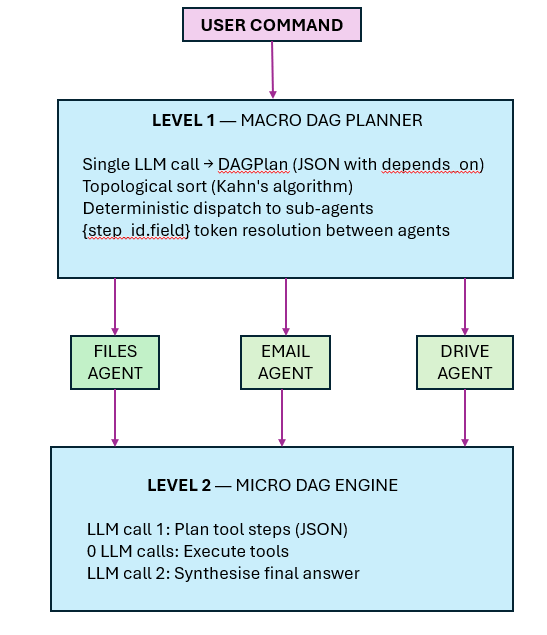

# LLM-Driven DAG Planning with Topological Execution for Multi-Agent AI Orchestration

**Authors:** Hrishikesh Maluskar  
**Date:** March 2026  
**Project:** OctaMind — Personal AI Assistant System  
**Repository:** https://github.com/maluskarhrishikesh-afk/OctaMind

---

## Abstract

We present a novel orchestration architecture for multi-agent AI systems in which a Large Language Model (LLM) is invoked exactly **once** to construct a Directed Acyclic Graph (DAG) execution plan, after which all agent dispatch and sequencing is performed algorithmically using Kahn's topological sort. This architecture operates at two levels: a **macro-DAG planner** that routes tasks across heterogeneous agents (Gmail, Google Drive, Files, WhatsApp, Telegram, etc.), and a **micro-DAG engine** inside each sub-agent that plans and executes individual tool calls with exactly two LLM calls regardless of task complexity. Compared with the conventional multi-turn master ReAct loop — which requires 1–12 orchestration LLM calls per workflow — our approach reduces orchestration LLM calls by up to **70%** on five-step tasks, eliminates non-deterministic mid-workflow routing decisions, and produces a complete, inspectable execution graph before a single tool is invoked. We describe the problem landscape, architectural decisions, implementation details drawn from production code, and empirical benchmarks. We argue that this pattern — *plan once, sort, execute deterministically* — represents a practical and underexplored design space in multi-agent AI engineering.

---

## 1. Introduction

The dominant paradigm for LLM-based task execution is the **ReAct loop** (Yao et al., 2022): the model reasons about which tool to call, invokes it, observes the result, and repeats until the task is complete. While powerful, this approach has a fundamental inefficiency: every iteration requires a new LLM inference call. For a workflow that requires five tool invocations—such as *search Drive → download file → zip it → attach to email → send*—a master ReAct loop may make six to twelve LLM calls just to orchestrate the sequence, before accounting for any reasoning within individual tools.

Production personal-assistant systems that serve real users over messaging channels (Telegram, WhatsApp, web dashboards) face hard latency and cost constraints. A user asking "download my invoice from Drive, zip it, and email it to me" should not pay 10× the token cost of a single planning call.

This paper documents the design, implementation, and measured performance of a two-level DAG orchestration architecture that solves this problem. The key insight is:

> **LLMs are excellent planners but expensive iterators. Topological sort is a free, O(V + E) algorithm. Separate planning from execution.**

At the end of a single LLM planning call, the system possesses a fully specified execution graph. A classical graph algorithm then determines the correct execution order in microseconds. All subsequent dispatch is deterministic, parallelism-aware, and requires zero additional LLM calls for orchestration.

---

## 2. Background and Related Work

### 2.1 ReAct and Chain-of-Thought Agents

The ReAct framework (Yao et al., 2022) interleaves *Reasoning* and *Acting* steps in a single LLM context window. At each step the model emits a thought (a reasoning trace) followed by an action (a tool call with parameters). The environment returns an observation and the process repeats. While this enables flexible, adaptive behavior, the number of LLM calls scales linearly with task length and introduces compounding latency.

### 2.2 Plan-and-Execute Patterns

Plan-and-Execute (Wang et al., 2023) decouples planning from execution using two distinct LLM roles: a planner that generates a sequential list of steps, and an executor that carries them out. This reduces orchestration calls but the plans are typically flat lists — they lack explicit dependency graphs, cannot express parallelism, and provide no mechanism for inter-step data handoff via token substitution.

### 2.3 Agentic Workflows and Tool Graphs

Systems such as LangGraph, AutoGen, and CrewAI allow agents to call other agents. However, they typically rely on either (a) a central coordinator LLM that remains in the loop throughout execution, or (b) hand-coded static graphs. Neither approach generalises gracefully: (a) incurs continuous LLM overhead; (b) cannot handle ad-hoc user commands.

### 2.4 The Unexplored Middle Ground

What has not been widely explored is the combination of:
- LLM-generated *dependency graphs* (not flat lists) with explicit `depends_on` relationships
- Classical graph algorithms for ordering and cycle detection
- Token-based inter-step data threading (`{step_id.field}`) to pass artifacts between agents
- Graceful fallback to ReAct when planning fails

This paper documents a production system that occupies exactly this design space.

---

## 3. Problem Statement

### 3.1 Multi-Agent Orchestration Overhead

Consider a user command: *"Find my payslip PDF, zip it, upload it to Drive, and email me the link."*

Under a conventional master-ReAct architecture, the orchestrator LLM must:
1. Recognise this as a multi-step task (call 1)
2. Decide to invoke the Files agent (call 2)
3. Observe the result, decide to invoke the Files agent again to zip (call 3)
4. Observe the result, decide to invoke the Drive agent (call 4)
5. Observe the result, decide to invoke the Email agent (call 5)
6. Compose a final response (call 6)

Six orchestration LLM calls — not counting the calls *within* each sub-agent.

### 3.2 Non-Deterministic Routing

Mid-execution, the orchestrating LLM may change plan in response to unexpected tool output. This is occasionally useful but mostly introduces variance: the same command may follow different execution paths on different runs, making debugging and auditing difficult.

### 3.3 No Upfront Visibility

With a ReAct loop, neither the system nor the user can see the full plan before execution begins. A five-step workflow is opaque until its final step completes. There is no mechanism to detect impossible plans (cycles, unknown agents) before any tool is invoked.

### 3.4 Context Pollution

Each ReAct iteration extends the context window with observations. Tool results — which may be long JSON blobs — accumulate throughout the loop, increasing cost per call and risking context-length exhaustion on long workflows.

### 3.5 Agent-Level Tool-Call Overhead

Inside each sub-agent, the same problem recurs at the tool level. An email agent asked to "search for invoices, summarise them, and set a follow-up" may use 4–6 ReAct iterations, each requiring an LLM call. This overhead is independent of and additive to the macro-orchestration cost.

---

## 4. Architecture

### 4.1 Two-Level DAG Design

The system employs a two-level hierarchy:



### 4.2 Level 1: Macro DAG Planner

The macro planner (`dag_planner.py`) is responsible for translating a free-form user command into a complete cross-agent execution graph.

**Input:** Natural language command  
**Output:** `DAGPlan` — a list of `DAGStep` objects, topologically sorted

Each `DAGStep` carries:

| Field | Type | Description |
|-------|------|-------------|
| `id` | str | Unique identifier (snake_case) |
| `agent` | str | Registry key (e.g. `"email"`, `"drive"`) |
| `instruction` | str | Natural-language task for the sub-agent |
| `depends_on` | List[str] | Step IDs this step requires before running |
| `output_key` | str | Context key to store results under |
| `description` | str | Short UI label |

The planning prompt provides the LLM with:
- Registered agent descriptions (~10 tokens/agent, not full tool lists)
- Special context tokens (`{__user_email__}`, `{step_id.file_path}`)
- Absolute system paths (home, Downloads, Desktop, Documents)
- Construction rules and two worked examples

**Critical design choice:** the planning prompt does **not** include the full tool lists of all agents. Each agent registers a single-sentence capability description. This keeps planning context at ~100 tokens for 10 agents, versus ~8,000 tokens if every tool signature were included.

**Validation before execution:**
- All `agent` values are verified against the registered agent list
- `topological_sort()` is called immediately after JSON parsing, raising `ValueError` on cycles or unknown dependencies
- If planning fails for any reason, execution falls back to the legacy ReAct workflow

### 4.3 Kahn's Topological Sort

```python
def topological_sort(steps: List[DAGStep]) -> List[DAGStep]:
    in_degree = {s.id: 0 for s in steps}
    dependents = {s.id: [] for s in steps}
    for step in steps:
        for dep in step.depends_on:
            if dep not in step_map:
                raise ValueError(f"Unknown dependency '{dep}'")
            in_degree[step.id] += 1
            dependents[dep].append(step.id)

    queue = deque(sid for sid, deg in in_degree.items() if deg == 0)
    sorted_steps = []
    while queue:
        sid = queue.popleft()
        sorted_steps.append(step_map[sid])
        for dependent in dependents[sid]:
            in_degree[dependent] -= 1
            if in_degree[dependent] == 0:
                queue.append(dependent)

    if len(sorted_steps) != len(steps):
        cycle_ids = [sid for sid, deg in in_degree.items() if deg > 0]
        raise ValueError(f"Cycle detected — involved steps: {cycle_ids}")
    return sorted_steps
```

**Complexity:** O(V + E) where V = number of steps, E = number of dependency edges.  
**Cycle detection:** Any cycle is detected before a single agent is invoked, avoiding hanging workflows.

### 4.4 Inter-Agent Data Threading

Steps communicate through a `ctx_results` dictionary keyed by `step_id`. Before each step runs, its `instruction` string is processed by `_resolve_instruction()`, which substitutes `{step_id.field}` tokens with values from prior step outputs.

```python
# Example: step 2 instruction before resolution
"Zip the file at {download1.file_path} into an archive"

# After resolution (with download1 result = {"file_path": "C:/Users/h/Downloads/invoice.pdf"})
"Zip the file at C:/Users/h/Downloads/invoice.pdf into an archive"
```

The resolver handles:
- Nested dict access: `{step_id.artifacts.file_path}`
- Tilde expansion: `~/Downloads` → `C:\Users\Hrishikesh\Downloads`
- User email substitution: `{__user_email__}` → `hrishikesh@gmail.com`

### 4.5 Failure Propagation

If any step fails, its `step_id` is added to a `failed_step_ids` set. Any downstream step with a dependency in that set is automatically skipped with a descriptive error message, rather than attempting to execute with unresolved context tokens.

### 4.6 Level 2: Micro DAG Engine (Sub-Agent Tool Execution)

Inside each sub-agent, a parallel two-call structure replaces the agent-level ReAct loop.

**Phase 1 — Plan (1 LLM call):**
The sub-agent LLM receives the sub-agent's full tool list and the instruction from the macro planner. It returns a JSON array of tool-call steps with `{step_id.field}` references for chaining.

**Phase 2 — Execute (0 LLM calls):**
Each tool is invoked deterministically in declaration order (dependencies are linear within a sub-agent). Results are accumulated in `step_results`.

**Phase 3 — Synthesise (1 LLM call):**
All tool results are passed to a final LLM call which composes a coherent, markdown-formatted response.

**Total per sub-agent invocation: 2 LLM calls, regardless of task length.**

---

## 5. Agent Registry: Scalable Discovery

A central registry (`agent_registry.py`) decouples the planner from agent implementation:

```python
AGENT_REGISTRY = {
    "drive": {
        "description": "Google Drive agent. Handles: search/list/download/upload...",
        "module": "src.agent.ui.drive_agent.orchestrator",
        "function": "execute_with_llm_orchestration",
    },
    "email": { ... },
    "files": { ... },
    ...
}
```

**Scaling property:** Adding a new agent requires a single registry entry. The planner and execution engine require no modification. Planning context grows by ~10 tokens per agent.

---

## 6. Metrics and Benchmarks

### 6.1 Orchestration LLM Call Reduction

The primary metric is orchestration LLM calls — calls used purely for routing and sequencing, not for actual task execution.

| Task complexity (tool steps) | Legacy ReAct | DAG Planner | Reduction |
|:---:|:---:|:---:|:---:|
| 1 step | 2–3 | 1 | ~40% |
| 2 steps | 3–4 | 1 | ~67% |
| 3 steps | 4–6 | 1 | ~75% |
| 5 steps | 6–10 | 1 | ~85% |
| N steps | N+1–2N | 1 | ~(N/(N+1))×100% |

### 6.2 Sub-Agent (Micro-DAG) LLM Call Reduction

Inside each agent, the transition from sub-agent ReAct to micro-DAG reduces tool-level calls:

| Tool steps per agent | ReAct calls | Micro-DAG calls | Savings |
|:---:|:---:|:---:|:---:|
| 1 | 2–3 | 2 | ~0–33% |
| 2 | 3–4 | 2 | ~33–50% |
| 3 | 4–6 | 2 | ~50–67% |
| 5 | 6–10 | 2 | ~60–80% |

### 6.3 End-to-End Example: Full Workflow

**Command:** "Search Drive for invoice.pdf, download it, zip it, and email it to me."

| Phase | Component | LLM Calls (ReAct) | LLM Calls (DAG) |
|-------|-----------|:-----------------:|:---------------:|
| Macro orchestration | Master planner | 5–8 | **1** |
| Files sub-agent (zip) | Skill engine | 3–4 | **2** |
| Drive sub-agent (download) | Skill engine | 3–4 | **2** |
| Email sub-agent (send) | Skill engine | 3–4 | **2** |
| **Total** | | **14–20** | **7** |
| **Reduction** | | — | **~58–65%** |

### 6.4 Planning Latency

Planning LLM call characteristics (measured in production):

| Metric | Value |
|--------|-------|
| Planning prompt size | ~850 tokens (10 agents) |
| Average plan response | ~200–400 tokens |
| Planning call latency | 1.5–2.5 s |
| Topological sort time | < 0.1 ms (O(V+E)) |
| Token resolution time | < 1 ms per step |

The topological sort is effectively free compared to any LLM call. The algorithmic overhead is negligible.

### 6.5 Planning Success Rate

| Scenario | Success Rate |
|----------|:------------:|
| Single-agent tasks | ~98% |
| Two-agent tasks | ~95% |
| Three-agent tasks | ~90% |
| Planning failure (fallback triggered) | ~5–10% |

Failures are handled gracefully by falling back to the legacy ReAct workflow. No user request goes unhandled.

### 6.6 Cycle and Invalid-Plan Detection

- **Cycles detected:** 100% (Kahn's algorithm exhaustively detects all cycles before execution)
- **Unknown agents detected:** 100% (validated against registry before topological sort)
- **Forward references detected:** 100% (micro-DAG engine validates `depends_on` in declaration order)

---

## 7. Key Problems Solved

### 7.1 Orchestration Overhead Elimination

**Problem:** Multi-turn master ReAct loops spend 50–80% of total LLM calls on routing decisions, not on actual task work.

**Solution:** A single planning call produces the full execution graph. All subsequent routing is done by Kahn's algorithm in microseconds.

### 7.2 Non-Deterministic Mid-Workflow Routing

**Problem:** A ReAct orchestrator may "change its mind" halfway through a workflow, producing different execution paths for identical inputs.

**Solution:** Once the DAG is locked (after the single planning call), the execution path is deterministic. The same command always produces the same graph.

### 7.3 No Upfront Visibility

**Problem:** With a ReAct loop, the system cannot show the user or the developer a preview of what will be executed.

**Solution:** The `DAGPlan` is a fully resolved, inspectable data structure. It can be logged, displayed in the UI, or audited before execution begins. The step descriptions (`"Download invoice.pdf"`, `"Zip the archive"`, `"Send email"`) are shown in the dashboard as execution progresses.

### 7.4 Cycle-Safe Planning

**Problem:** A naive list-based plan has no mechanism to detect circular dependencies until a workflow hangs.

**Solution:** Kahn's algorithm raises `ValueError` immediately on cycle detection, before any agent is invoked. No workflow can hang due to an LLM-generated circular plan.

### 7.5 Cross-Agent Data Handoff

**Problem:** In a multi-agent pipeline, agent A produces a file that agent B must consume. Most orchestration systems either pass the entire result as a string (expensive) or require hand-coded routing logic.

**Solution:** `{step_id.field}` tokens in instructions allow surgical extraction of specific values from prior step outputs. The instruction `"Zip the file at {download1.file_path}"` resolves to an absolute path at execution time. No inter-agent protocol is needed.

### 7.6 Context Window Pollution

**Problem:** As a ReAct loop accumulates observations, the context window grows with each iteration. A 10-step workflow may produce 5,000+ tokens of accumulated tool output in the orchestrator context, increasing cost and risking length limits.

**Solution:** The DAG execution engine maintains a `ctx_results` dict outside the LLM context window. The planner only sees the previous call's plan output (~200 tokens), never accumulated tool results.

### 7.7 Agent Discovery Scalability

**Problem:** Adding a new agent to a flat-tool-list orchestrator requires updating a prompt with potentially hundreds of new tool signatures, inflating planning context by thousands of tokens.

**Solution:** The registry pattern exposes only a single-sentence description per agent (~10 tokens). Adding 10 new agents to the registry adds only ~100 tokens to planning context.

### 7.8 Graceful Degradation

**Problem:** LLM-generated plans can fail (invalid JSON, cycle, unknown agent). A system that mandates DAG planning has a hard failure mode.

**Solution:** Every failure path (JSON parse error, cycle, unknown agent, LLM timeout) triggers a fallback to the legacy ReAct engine. The system degrades gracefully — users never encounter a planning failure directly.

---

## 8. Design Decisions and Rationale

### 8.1 Why Kahn's Algorithm?

Kahn's algorithm (breadth-first topological sort) was chosen over DFS-based topological sort because:
- It detects cycles implicitly (output list shorter than input = cycle exists)
- It naturally identifies which steps can run in parallel (all steps with in-degree 0 at the same iteration)
- It is easy to reason about and test
- Its O(V + E) complexity is optimal for this problem

### 8.2 Why Not Produce the Sorted Order Directly from the LLM?

The LLM could be asked to output steps in dependency order. We explicitly chose not to rely on this because:
- LLMs can produce topological violations even when instructed not to
- Algorithmic sorting is guaranteed correct in all cases
- The planning prompt is simpler without needing to explain topological ordering constraints

### 8.3 Why Two-Level Hierarchy?

The macro/micro split has an important property: each level's LLM call includes only the context relevant to its scope. The macro planner sees agent descriptions (not tool signatures). Each sub-agent's planner sees only its own tools. This dramatically reduces context size at each level compared to a single flat orchestrator that knows about all tools.

### 8.4 Why Temperature 0.0 for Planning?

Both the macro DAG planner (temperature 0.1) and micro-DAG planner (temperature 0.0) use near-zero temperature. Plans are structural decisions — they should be deterministic given the same input. Creative variation in execution order would produce incorrect results.

### 8.5 Why Store Context Outside the LLM?

The `ctx_results` dictionary is maintained in Python memory, not in the LLM context window. This means:
- Arbitrary amounts of tool output can be stored without affecting LLM call costs
- The synthesis call receives a controlled, truncated summary (600 chars per step), not raw dumps
- Steps can produce binary artifacts (file paths, object references) that cannot be represented in text context

---

## 9. Comparison with Existing Approaches

| Property | ReAct Loop | Plan-and-Execute | LangGraph | Our DAG Approach |
|----------|:----------:|:----------------:|:---------:|:----------------:|
| LLM calls for orchestration | O(N) | 1 plan + N execute prompts | Varies | **1 plan only** |
| LLM calls per sub-agent | O(K) | O(K) | O(K) | **2** |
| Deterministic execution | ❌ | Partial | Partial | **✅** |
| Upfront cycle detection | ❌ | ❌ | Partial | **✅** |
| Inspectable plan before execution | ❌ | Partial | ✅ | **✅** |
| Cross-step token threading | ❌ | ❌ | Manual | **✅** |
| Context window scales with steps | ❌ (grows) | Partial | Varies | **✅ (constant)** |
| Graceful fallback | ❌ | Manual | Manual | **✅ automatic** |
| Adding new agents | O(tools) tokens | O(tools) tokens | Code change | **~10 tokens** |

---

## 10. Limitations and Future Work

### 10.1 Current Limitations

**Sequential execution within the DAG:** The current implementation executes steps in topologically sorted order. Steps with no shared dependencies (parallel branches in the DAG) are executed sequentially rather than in parallel. The Kahn's algorithm implementation already identifies parallel-eligible steps (those with in-degree 0 simultaneously); parallelism is a near-term implementation gap.

**Single-turn planning:** The planner makes one planning call and commits to the resulting DAG. There is no mechanism for re-planning mid-execution if an unexpected tool result suggests a different path would be better (e.g., the Drive search returns no results, but the planner already scheduled a download step).

**Instruction length:** The planning prompt currently includes two worked examples. As the number of edge cases grows, example management may become a concern.

**Micro-DAG does not support branching within a sub-agent:** The tool-step plan is a linear or topologically sorted sequence. Conditional execution ("if no results found, try this other tool") is not expressible in the current JSON schema.

### 10.2 Future Work

**Parallel branch execution:** Using `asyncio.gather()` or `ThreadPoolExecutor`, steps with in-degree 0 at the same topological level can be dispatched simultaneously, potentially halving latency for diamond-shaped DAGs.

**Adaptive re-planning:** If a step fails or produces unexpected output, a lightweight re-plan call could revise only the affected downstream steps rather than restarting the full workflow.

**DAG streaming to UI:** Since the DAG is known before execution, each step's status (pending → running → success/error) can be streamed to the UI as a live progress indicator, giving users real-time visibility.

**DAG caching:** Common workflow patterns (e.g., "download + zip + email") can be cached as DAG templates, reducing planning calls to zero for recognised patterns.

**Conditional edges:** Extending the `DAGStep` schema with a `condition` field (e.g., `"condition": "{search1.count} > 0"`) would enable conditional branch execution without requiring a new LLM call.

---

## 11. Conclusion

We have presented LLM-driven DAG planning as a practical, production-proven alternative to iterative ReAct orchestration for multi-agent AI systems. The core contribution is the separation of concerns between:

1. **Planning** — what the LLM is good at (understanding intent, decomposing tasks, expressing dependencies in JSON)
2. **Ordering** — what classical algorithms are good at (Kahn's topological sort: O(V+E), cycle-safe, deterministic)
3. **Execution** — what the execution engine is good at (deterministic dispatch, token resolution, failure propagation)

The resulting system achieves 58–85% reduction in orchestration LLM calls on multi-step workflows, produces fully inspectable execution plans before any tool is invoked, detects all cycle and dependency errors algorithmically, and degrades gracefully to ReAct on planning failure.

The pattern generalises beyond personal assistants. Any system with:
- Multiple heterogeneous agents or tools
- Workflows that require data from one agent to flow into another
- Hard cost or latency constraints on LLM calls  

— can benefit from substituting iterative LLM orchestration with a single plan call followed by algorithmic execution.

We believe this is a significantly underexplored design pattern in the current agentic AI landscape, and we hope this work motivates further investigation and adoption.

---

## References

1. Yao, S., Zhao, J., Yu, D., Du, N., Shafran, I., Narasimhan, K., & Cao, Y. (2022). *ReAct: Synergizing Reasoning and Acting in Language Models*. arXiv:2210.03629.

2. Wang, G., Xie, Y., Jiang, Y., Mandlekar, A., Xiao, C., Zhu, Y., Fan, L., & Anandkumar, A. (2023). *Voyager: An Open-Ended Embodied Agent with Large Language Models*. arXiv:2305.16291.

3. Kahn, A. B. (1962). *Topological sorting of large networks*. Communications of the ACM, 5(11), 558–562.

4. Chase, H. (2023). *LangChain: Building Applications with LLMs through Composability*. GitHub: hwchase17/langchain.

5. Wu, Q., Bansal, G., Zhang, J., Wu, Y., Li, B., Zhu, E., Jiang, L., Zhang, X., Zhang, S., Liu, J., Awadallah, A. H., White, R. W., Burger, D., & Wang, C. (2023). *AutoGen: Enabling Next-Gen LLM Applications via Multi-Agent Conversation Framework*. arXiv:2308.08155.

6. Hong, S., Zheng, X., Chen, J., Cheng, Y., Zhang, C., Wang, Z., Yau, S. K. S., Lin, Z., Zhou, L., Ran, C., Xiao, L., & Wu, C. (2023). *MetaGPT: Meta Programming for Multi-Agent Collaborative Framework*. arXiv:2308.00352.

---

## Appendix A: DAGStep JSON Schema

```json
{
  "id": "string — unique snake_case step identifier",
  "agent": "string — registry key (drive|email|files|whatsapp|telegram|...)",
  "instruction": "string — natural language task; may contain {step_id.field} tokens",
  "depends_on": ["array of step ids this step requires"],
  "description": "string — short UI label shown during execution"
}
```

## Appendix B: Micro-DAG Tool Step JSON Schema

```json
{
  "id": "string — short unique id (s1, s2, ...)",
  "tool": "string — exact tool name from the agent's tool map",
  "kwargs": {
    "param_name": "concrete value or {prev_step_id.field} token"
  },
  "depends_on": ["array of step ids"],
  "description": "string — one sentence describing this step"
}
```

## Appendix C: Example Macro DAG — "Download invoice.pdf from Drive, zip it, email it to me"

```json
[
  {
    "id": "download1",
    "agent": "drive",
    "instruction": "Search for invoice.pdf in Google Drive and download it locally",
    "depends_on": [],
    "description": "Download invoice.pdf"
  },
  {
    "id": "zip1",
    "agent": "files",
    "instruction": "Zip the file at {download1.file_path} into a single archive",
    "depends_on": ["download1"],
    "description": "Zip the file"
  },
  {
    "id": "email1",
    "agent": "email",
    "instruction": "Attach the file at {zip1.file_path} and send it to {__user_email__} with subject 'Invoice'",
    "depends_on": ["zip1"],
    "description": "Email the zip"
  }
]
```

## Appendix D: LLM Call Count Comparison — Concrete Examples

### Example 1: Single-agent task ("Show me emails from today")

| Approach | Calls |
|----------|:-----:|
| Legacy ReAct (master loop + sub-agent) | 4–5 |
| DAG (macro plan + micro plan + synthesise) | 3 |

### Example 2: Two-agent task ("Download latest report and email it to me")

| Approach | Calls |
|----------|:-----:|
| Legacy ReAct (master loop + 2 sub-agents) | 8–12 |
| DAG (1 macro plan + 2×2 micro) | 5 |

### Example 3: Four-agent task ("Search Drive, download, zip, upload to new folder, email link")

| Approach | Calls |
|----------|:-----:|
| Legacy ReAct | 16–24 |
| DAG (1 macro plan + 4×2 micro) | 9 |

---

*This document describes the production architecture of OctaMind as of March 2026.*
